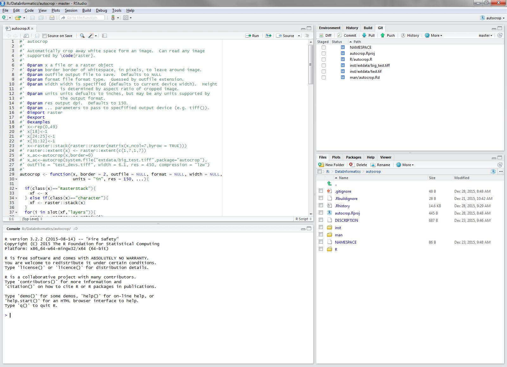
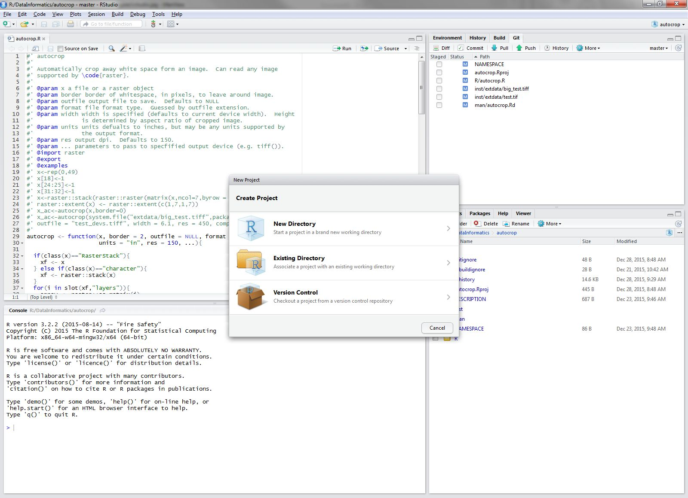
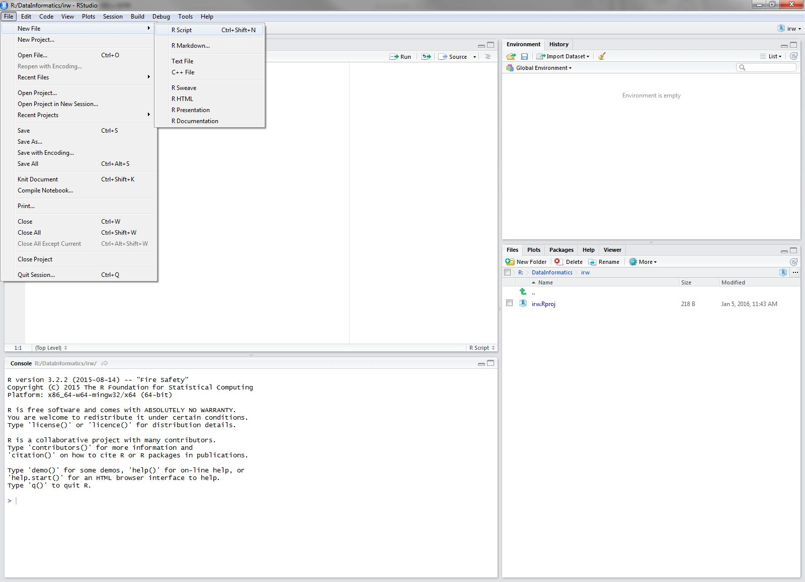

```{r setup, echo=FALSE, warning=FALSE, purl=FALSE, message=FALSE}
options(repos="http://cran.rstudio.com/")
```

# R Basics

In this first lesson we are going to go over the very basics of R, cover some basic terminology, talk a little about syntax and point you to resources for getting help.

## Lesson Outline:

- [Working with R and RStudio](#working-with-r-and-rstudio)
- [Workflow](#workflow)
- [Functions and basic syntax](#functions-and-basic-syntax)
- [Packages](#packages)
- [Operators and objects](#operators-and-objects)
- [Getting help](#getting-help)

## Lesson Exercises:
- [Exercise 1.1](#exercise-11)
- [Exercise 1.2](#exercise-12)
- [Exercise 1.3](#exercise-13)

##Working with R and RStudio
Over the last several years, RStudio has become a very popular IDE (integrated development environment) for R. In addition to interacting with the R Console, RStudio has many extras built in including version control integration, package building, reproducible research, de-bugging, and built-in text editor with smart highlighting and code completion.  This is the environment we will be using for the workshop and should set you up for continued learning with R.

Before we get to the first exercise, let's spend a bit of time working with RStudio. Just watch as I demo this.  The first exercise will have you doing these steps.

###Fire up R and RStudio
Find the RStudio shortcut or menu (OS specific of course) and fire it up.  Once done, it should look something like:



###Create a Project
Projects are a way to organize your work in RStudio.  Essentially they are simply folders, but with a few added files so that you can manage some options on a per project basis.  To create a new project use File:New Project, or use the drop-down on the top right of the RStudio window.  It will look like this after you select "New Project..."



###Create a Script
Scripts are text files that hold the code you write.  We will work both with scripts and the console during this workshop.  To create a new script you use "File:New File:R Script".



##Exercise 1.1
This exercise will make sure R and RStudio are working and that you can get around the basics in RStudio.  Use the green stickies when you have completed, and red stickies if you are running into problems.

1. Start RStudio: To start both R and RStudio requires only firing up RStudio.  RStudio should be available from All Programs at the Start Menu.  Fire up RStudio. 

2. Take a few minutes to look around RStudio.  Find the Console Pane. Find Global and Project Options (hint: look in Tools).  Look at the Environment, History Pane.  Look at the Files, Plots, Packages, etc. pane.

3. Create a new project.  Name it "intro_r_workshop".  We will use this for the rest of the workshop.

4. Create a new "R Script" in the Source Pane, save that file into your newly created project and name it "lesson1.R". It'll just be a blank text file at this point.

5. Download the [R code for the workshop](https://raw.githubusercontent.com/rhodyrstats/intro_r_workshop/master/lessons/intro_r_code.R) and save it in the project folder. 

##Workflow
Before we move on, we need to introduce a few of the basics about working in the console, working via scripts, and workspaces/projects.  We will also start working with some simple, yet important R functions.

Being thoughtful about workflow from the beginning of a project is something that gets overlooked a lot, but a little up-front effort can provide a big benefit.  For our purposes we are going to make use of RStudio projects and will script almost everything.  The console has its utility and we will use it plenty, especially when we are first figuring out how to use commands.  But beyond that, we will store all of our work in a script.  The basic workflow I am going to advocate is:

1. Use a single project for this workshop (we created that in Lesson 1: Exercise 1).
2. Start everything in a script and use copy/paste or the RStudio tools to send to the console.
3. Use a new script for each lesson.
4. Comment ruthlessly.
5. Don't save .RData files or workspace history.  The script should recreate whatever you need.

This, of course, is not the only way you can structure a workflow, but I think it should be a good starting point for this workshop and one you can adapt to your own work afterwards.  And to provide a little motivation, the more you utilize scripts, the more reproducible your work is, the more likely you will be able to recall what you did 3 months from now (your future self will thank you), and the easier it will be to transition your work from scripts to functions and, ultimately, to R packages.

##Functions and basic syntax

R is built off of functions and most of everything you do uses a function.

The basic syntax of function follows the form: `function_name(arg1, arg2, ...)`.  With the base install, you will gain access to many.  For instance:

```{r function_examples}
#Print
print("hello world!")
#A sequence
seq(1,10)
#Random normal numbers
rnorm(100,mean=10,sd=2)
#Mean
mean(rnorm(100))
#Sum
sum(rnorm(100))
```

A few side notes.  The `#` indicates a comment.  You can put whatever else you'd like after this, but on the same line as the `#`.  R will not evaluate it. Multiple `#####`, are still just seen as a comment.  When commenting your code, err on the side of too much!  Also, you will see `()`, `[]`, and `{}` used in R code.  The `()` indicates a function (almost always), the `[]` indicates indexing (grabbing values by the location), and the `{}` groups code that is meant to be run together and is usually used when programming functions in R.

##Packages

The base install of R is quite powerful, but you will soon have a need or desire to go beyond this.  Packages provide this ability.  They are a standardized method for extending R with new methods, techniques, and programming functionality.  There is a lot to say about packages regarding finding them, using them, etc., but for now let's focus just on the basics.  

###CRAN
One of the reasons for R's popularity is CRAN, [The Comprehensive R Archive Network](http://cran.r-project.org/).  This is where you download R and also where most will gain access to packages (there are other places, but that is for later).  Not much else to say about this now other than to be aware of it.

###Installing packages
When a package gets installed, that means the source is downloaded and put into your library.  A default library location is set for you so no need to worry about that.  In fact on Windows most of this is pretty automatic.  Let's give it a shot.


```{r install_package, }
#Install dplyr and ggplot2
install.packages("ggplot2")
install.packages("dplyr")

#You can also put more than one in like
install.packages(c("randomForest","formatR"))
```

###Loading packages
One source of confusion that many have is when they cannot access a package that they just installed. This is because getting to this point requires an extra step, loading (or attaching) the package.   

```{r load_package}
#Add libraries to your R Session
library("ggplot2")
library("dplyr")

#You can also access functions without loading by using package::function
randomForest::randomForest

```

You will often see people use `require()` to load a package. It is better form to not do this. For a more detailed explanation of why `library()` and not `require()` see [Yihui Xie's post on the subject](http://yihui.name/en/2014/07/library-vs-require/.)

###Some other useful commands
There are a lot of other commands that help you navigate packages

```{r other_packages, eval=FALSE}
#See what is installed
installed.packages()

#What packages are available?
available.packages()

#Update, may take a while if you have many packages installed
update.packages()
```

Lastly, a quick note on packages and libraries.  You will often hear people use the terms interchangeably.  This is not correct.  A package is what is submitted to CRAN, it is what contains a group of functions that address a common problem, and it is what has allowed R to expand.  A library is, more or less, where you packages are stored.  You have a path to that library and this is where R puts new packages that you install (e.g. via `install.packages()`).  These two terms are related, but most certainly different.  Apologies up front if I slip and use one when I actually mean the other...

##Exercise 1.2
For this second exercise we are going to get used to using some basic functions, working with scripts and not just the console, and look through some task views and get used to basic navigation around packages.  Use the green stickies when you have completed, and red stickies if you are running into problems.

1. If it is not already open, open the "lesson1.R" file you created in Exercise 1. Enter your commands into this script.
2. Add the `print` function to your script.  Copy/past this or use the "run" button in RStudio to have R interpret it and print something to the screen.
3. Combine `mean` and `rnorm` to return the mean value of a set of random numbers.
4. Install the package, `dplyr`
5. Load `dplyr` into your library.
6. Make sure to save all these functions inside your "lesson1.R" script.  

##Operators and objects
As I mentioned above, the console and using R interactively is very powerful.  We will do this quite a bit.  Let's spend a little time playing around in the console and learn a few new functions.

R can be used as a calculator and a way to compare values.  Some examples of the basic operators:

```{r operators_consoloe}
#A really powerful calculator!
1+1 #Add
10-4 #Subtract
3*2 #Multiply
3^3 #Exponents
100/10 #Divide
5%%2 #Modulus
5>2 #Greater than
4<5 #Less than
5<=5 #Less than or equal
8>=2 #Greater than or equal
2==2 #Equality: notice that it is TWO equal signs!
5!=7 #Not Equals
```

That's neat, but so what...  

Well, it could be interesting to do something with those values and save them for re-use.  We can do that with objects (everything in R is an object) and use the assignment operator, `<-`.  Know that object names cannot start with a number, contain spaces, or (most) special characters.  Underscore and periods are allowed.  

**NOTE:** If you have experience with other, object-oriented languages, then just be aware that R objects, at least the general use of the term, are different.  

```{r assignment_operator}
#Numeric assignment
x<-5
x
y<-x+1
y
z<-x+y
z
#Character
a<-"Bob"
a
b<-"Sue"
b
a2<-"Larry"
a2
```

Now that we have a little experience working in the console and creating objects with `<-`, we might want to be able to do some additional things to navigate around, look at these objects etc.

Some functions that you might find useful for working with your R workspace:

```{r useful_functions_workspace, eval=FALSE}
#List all objects in current workspace
ls() 
ls(pattern="a")

#Remove an object
rm(x)

#Save your workspace
#Saves the whole thing to a file called lesson2.RData
save.image("lesson2.RData") 
#Saves just the a and y objects to a file called lesson2_ay.RData
save(a,y,file="lesson2_ay.RData")
```

This is probably a good spot to bring up quotes vs no quotes around arguments in a function.  This is a very common stumbling block.  The general rule is that no quotes are used only when referring to an object that currently exists.  Quotes are used in all other cases.  For instance in `save(a,y,file="lesson2_ay.RData")` the objects `a` and `y` are not quoted because they are objects in the workspace.  `file` is an argument of save and arguments are never quoted.  We quote the name of the file "lesson2_ay.RData" because it is not an R object but the name of a file to be created.  You will likely still have some issues with this.  My recommendation is to think about if it is an object in your R workspace or not.  If so, no quotes! This isn't foolproof, but works well most of the time.

Next thing you might want to do is navigate around your files and directories.

```{r useful_functions_directory}
#See the current directory
getwd()

#Change the directory
setwd("figures")

#List files and directories
list.files()
```

While you can do this directly from the console, it is going to be better practice to mostly use RStudio projects to manage your folders, working directory etc.  You can also navigate using the Files, etc. pane. 

##Exercise 1.3
Remember to add each of these as new lines to your `lesson1.R` script.  Also, please still use the green stickies when you have completed, and red stickies if you are running into problems. So, for this exercise:

1. Create two objects named `number1` and `number2` and give them the values of 25 and 4, respectively 
2. Create two more objects named `string1` and `string2`, give them any character string that you would like. 
3. Now using `number1`,`number2`, and the power of math create an object called `number3` that equals 100.
4. Create two more objects whose value is of your choosing
5. List the objects in your workspace
6. Remove `string2`
10. Try to add `string1` and `number1`.  What happens?  

##Getting help
Being able to find help and interpret that help is probably one of the most important skills for learning a new language.  R is no different. Help on functions and packages can be accessed directly from R, can be found on CRAN and other official R resources, searched on Google, found on StackOverflow, or from any number of fantastic online resources. I will cover a few of these here. 

###Help from the console
Getting help from the console is straightforward and can be done numerous ways.

```{r help_from_console, eval=FALSE}
#Using the help command/shortcut
help("print") #Help on the print command
?print #Help on the print command using the `?` shortcut
help(package="dplyr") #Help on the package `dplyr`

#Don't know the exact name or just part of it
apropos("print") #Returns all available functions with "print" in the name
??print #Shortcut, but also searches demos and vignettes in a formatted page

```

###Official R Resources
In addition to help from within R itself, CRAN and the R-Project have many resources available for support.  Two of the most notable are the mailing lists and the [task views](http://cran.r-project.org/web/views/).

- [R Help Mailing List](https://stat.ethz.ch/mailman/listinfo/r-help): The main mailing list for R help.  Can be a bit daunting and some (although not most) senior folks can be, um, curmudgeonly...
- [R-sig-ecology](https://stat.ethz.ch/mailman/listinfo/r-sig-ecology): A special interest group for use of R in ecology.  Less daunting the the main help with participation from some big names in ecological modelling and statistics (e.g., Ben Bolker, Gavin Simpson, and Phil Dixon).  One of the moderators is great, the other is a bit of a jerk (it's me).
- [Environmetrics Task View](http://cran.r-project.org/web/views/Environmetrics.html): Task views are great in that they provide an annotated list of packages relevant to a particular field.  This one is maintained by Gavin Simpson and has great info on packages relevant to much of the work at EPA.
- [Spatial Analysis Task View](http://cran.r-project.org/web/views/Spatial.html): One I use a lot that lists all the relevant packages for spatial analysis, GIS, and Remote Sensing in R. 

###Google and StackOverflow
While the resources already mentioned are useful, often the quickest way is to just turn to Google.  However, a search for "R" is a bit challenging.  A few ways around this.  Google works great if you search for a given package.  You can search for mailing lists directly (i.e. "R-sig-geo").  An R specific search tool, [RSeek.org](http://www.rseek.org/), has been created to facilitate this.  

One specific resource that I use quite a bit is [StackOverflow with the 'r' tag](http://stackoverflow.com/questions/tagged/r).  StackOverflow is a discussion forum for all things related to programming.  You can then use this tag and the search functions in StackOverflow and find answers to almost anything you can think of.

###Other Resources
As I mention earlier, there are TOO many resources to mention and everyone has their favorites.  Below are just a few that I like.

- [R For Cats](http://rforcats.net/): Basic introduction site, meant to be a gentle and light-hearted introduction
- [Advanced R](http://adv-r.had.co.nz/): Web home of Hadley Wickham's new book.  Gets into more advanced topics, but also covers the basics in a great way.
- [Why R is Hard To Learn](http://r4stats.com/articles/why-r-is-hard-to-learn/): Long and detailed blog post discussing some of the challenges people often face when learning R.
- [Other Resources](http://scicomp2014.edc.uri.edu/resources.html): A list I helped compile for a URI Class.
- [CRAN Cheatsheets](http://cran.r-project.org/doc/contrib/Short-refcard.pdf): A good cheat sheet from the official source
- [RStudio Cheatsheets](http://www.rstudio.com/resources/cheatsheets/): Additional cheat sheets from RStudio.  I am especially fond of the data wrangling one.