# Data Visualization

Visualizing  data is an area where R really shines.  Again, will split our focus between base and an installed package, `ggplot2`.  I will show some quick and easy graphics that we can produce with base R, but we won't spend anytime customizing them. Instead, we will move on quickly to `ggplot2`, which is now (I have no data to back this up), the de-facto standard for visualizing data in R.  We have only a very short time to spend on this, but hopefully it will provide enough of a foundation for future learning.

## Lesson Outline:

- [Simple plots with base R](#simple-plots-with-base-r)
- [Introduction to `ggplot2`](#introduction-to-ggplot2)
- [Customizing `ggplot2` plots](#customizing-ggplot2-plots)
- [Cool stuff and getting help with `ggplot2`](#cool-stuff-and-getting-help-with-ggplot2)

## Lesson Exercises:
- [Exercise 4.1](#exercise-41)
- [Exercise 4.2](#exercise-42)

##Simple plots with base R
When you first get a dataset and are just starting to explore it, you want do be able to quickly visualize different bits and pieces about the data.  I tend to do this, initially, with base R. We will cover some quick plots with base R.  Later we are going to go into more detail on `ggplot2` which is becoming the gold standard of viz in R.  For now we will look at some of the simple, yet very useful, plots that come with base R.  

The workhorse function for plotting data in R is `plot()`.  With this one command you can create almost any plot you can conceive of, but for this workshop we are just going to look at the very basics of the function.  The most common way to use `plot()` is for scatterplots.  Let's look at the `mtcars` data.


```r
plot(mtcars$hp,mtcars$qsec)
```

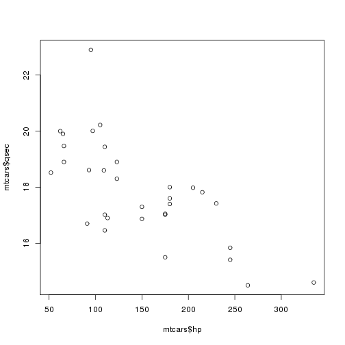 

Hey, a plot!  Not bad.  Let's customize a bit because those axis labels aren't terribly useful and we need a title. For that we can use the `main`, `xlab`, and `ylab` arguments.


```r
plot(mtcars$hp,mtcars$qsec,main="Changes in Quartermile time as function of horsepower",
     xlab="Total Horsepower",ylab="Quartermile Time (secs)")
```

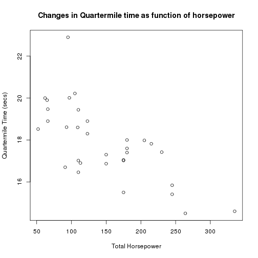 

Not sure if this will apply to everyone, but I use scatterplots ALL the time.  So, for me I could almost (not really) stop here.  But lets move on.  Let's say we want to look at more than just one relationship at a time with a pairs plot.  Again, `plot()` is our friend.  If you pass a data frame to `plot()` instead of an x and y vector it will plot all possible pairs.  Be careful though, as too many columns will produce an unintelligble plot.  Let's go back to `iris`.


```r
plot(iris, main="Iris Pairs Plot")
```

 

Last thing I will show with plot is how to add a line.  The one I use most often for exploratory analysis is a straight line defined by slope and intercept.  We do this with `abline()`.

We can add a horizontal line and vertical line easily with this as follows:


```r
plot(iris$Petal.Width,iris$Petal.Length, main="Petal Dimensions")
#horizontal line at specified y value
abline(h=4)
#a vertical line
abline(v=1.5)
#Line with a slope and intercept
abline(0,1)
```

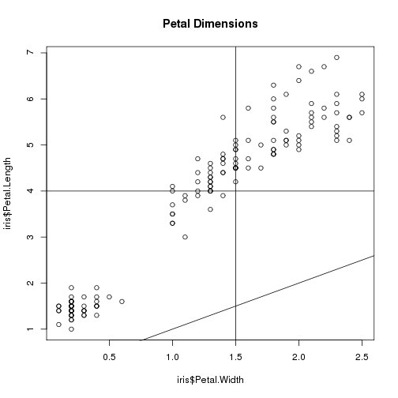 

This is useful if you have a known value that you want to compare to your data.  Next example is putting a regression line on the plot.  We haven't talked about regression in R yet, but this example is simple enough I think we can get away with introducing it.  


```r
plot(iris$Petal.Width,iris$Petal.Length, main="Petal Dimensions")
#abline accepts a liner model object as input
#linear model is done with lm, and uses a formula as input
abline(lm(Petal.Length~Petal.Width,data=iris))
```

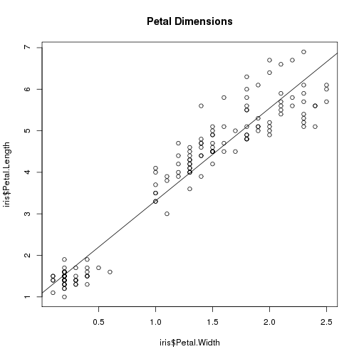 

Next, let's look at boxplots, histograms, and cumulative distribution functions then call it quits on the base R plots.

Two great ways to use boxplots are straight up and then by groups in a factor. For this we will use `boxplot()` and in this case it is looking for a vector as input. Sticking with `iris`:


```r
boxplot(iris$Petal.Length, main="Boxplot of Petal Length",ylab="Length(cm)")
```

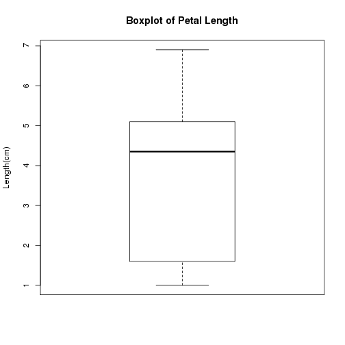 

As plots go, well, um, not great.  Let's try it with a bit more info and create a boxplot for each of the groups.  This is using formula notation which is in the base form of `y ~ x`.  Thinking about this form a 2-dimensional plot standpoint it makes sense as your x-axis is the species and y is the value of interest.


```r
boxplot(iris$Petal.Length~iris$Species, main="Boxplot of Petal Length by Species",ylab="Length(cm)")
```

 

Lastly, let's look at two other ways to plot our distributions.  First, histograms.


```r
hist(iris$Sepal.Length)
```

 

```r
hist(airquality$Temp,breaks=10)
```

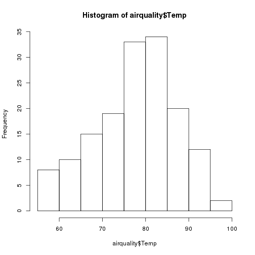 

And finally, cumulative distribution functions.  Since CDF's are actually a function of the distribution we need to get that function first.  This requires that we combine `plot()` and `ecdf()`, the emprical CDF function.


```r
aq_temp_ecdf<-ecdf(airquality$Temp)
plot(aq_temp_ecdf)
```

 

##Introduction to `ggplot2`

A lot has been written and discussed about `ggplot2`.  In particular see [here](http://ggplot2.org/), [here](http://docs.ggplot2.org/current/) and [here](https://github.com/karthikram/ggplot-lecture).  The gist of all this, is that `ggplot2` is an implementation of something known as the "grammar of graphics."  This separates the basic components of a graphic into distinct parts (e.g. like the parts of speech in a sentence).  You add these parts together and get a figure.

Before we start developing some graphics, we need to do a bit of package maintenance as `ggplot2` is not installed by default.


```r
install.packages("ggplot2")
library("ggplot2")
```

First thing we need to do is to create our ggplot object.  Everything we do will build off of this object.  The bare minimum for this is the data (handily, `ggplot()` is expecting a data frame) and `aes()`, or the aesthetics layers.  Oddly (at least to me), this is the main place you specify your x and y data values.


```r
# aes() are the "aesthetics" info.  When you simply add the x and y
# that can seem a bit of a confusing term.  You also use aes() to 
# change color, shape, size etc. of some items 
iris_gg<-ggplot(iris,aes(x=Petal.Length,y=Petal.Width))
```

Great, nothing happened...  All we did at this point is create an object that contains our data and what we want on the x and y axes.  We haven't said anything about what type of plot we want to make.  That comes next with the use of geometries or `geom_`'s.  

So if we want to simply plot points we can add that geometry to the ggplot object.  

A side note on syntax.  You will notice that we add new "things" to a ggplot object by adding new functions.  In concept this is very similar to the piping we talked about earlier.  Essentially it takes the output from the first function as the input to the second.  So to add points and create the plot, we would do:


```r
#Different syntax than you are used to
iris_gg + 
  geom_point()
```

 

```r
#This too can be saved to an object
iris_scatter<-iris_gg +
                geom_point()

#Call it to create the plot
iris_scatter
```

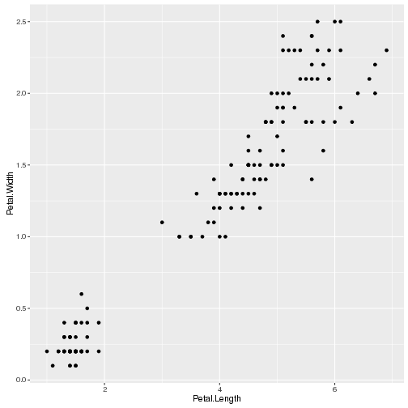 

Not appreciably better than base, in my opinion.  But what if we want to add some stuff...

First a title and some axes labels.  These are part of `labs()`.


```r
iris_scatter<-iris_scatter +
                labs(title="Iris Petal Morphology Relationship",
                     x="Petal Length", y="Petal Width")
iris_scatter
```

 

Now to add some colors, shapes etc to the point.  Look at the `geom_point()` documentation for this.


```r
iris_scatter<- iris_scatter +
                geom_point(aes(color=Species, shape=Species),size=5)
iris_scatter
```

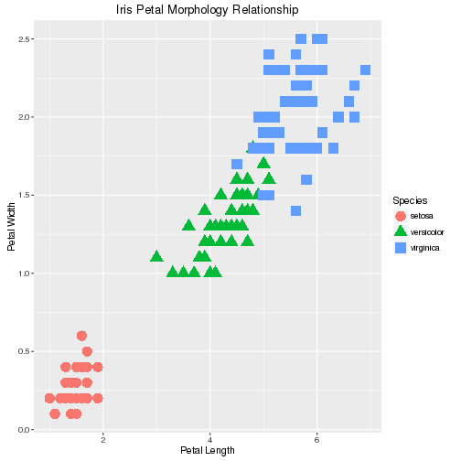 

You'll notice we used `aes()` again, but this time inside of the geometry.  This tells ggplot2 that this aes only applies to the points.  Other geometeries will not be affected by this.

In short, this is much easier than using base.  Now `ggplot2` really shines when you want to add stats (regression lines, intervals, etc.). 

Lets add a loess line with 95% confidence intervals


```r
iris_scatter_loess<-iris_scatter +
                geom_smooth()
iris_scatter_loess
```

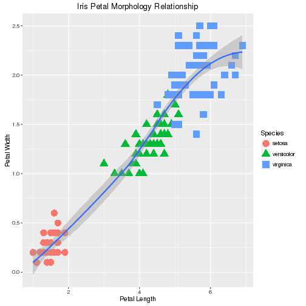 

Try that in `base` with so little code!

Or we could add a simple linear regression line with:


```r
iris_scatter_lm<-iris_scatter +
                  geom_smooth(method="lm")
iris_scatter_lm
```

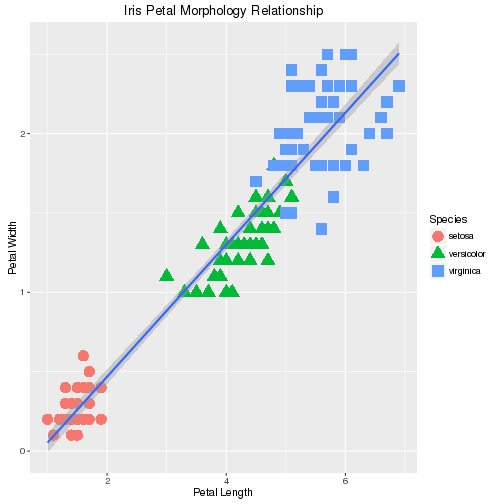 

And if we are interested in the regressions by group we could do it this way.


```r
iris_scatter_lm_group<-iris_scatter+
                        geom_smooth(method="lm", 
                                    aes(group=Species))
iris_scatter_lm_group
```

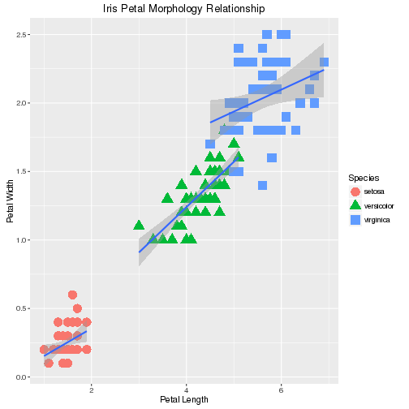 

Or, if we wanted our regression lines to match the color.


```r
iris_scatter_lm_color<-iris_scatter+
                        geom_smooth(method="lm", 
                                    aes(color=Species))
iris_scatter_lm_color
```

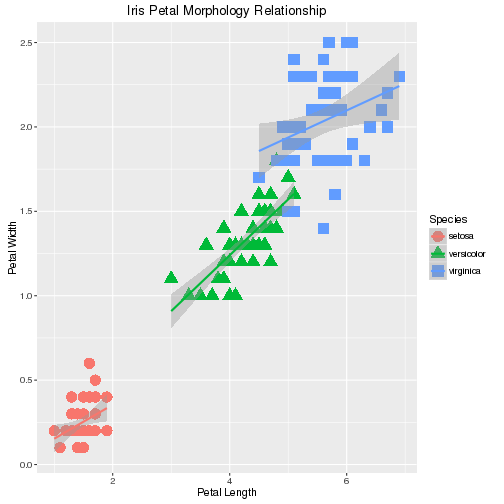 


I mentioned this above, but not again, that we specified the `aes()` again, but for `geom_smooth()`.  We only specified the x and y in the original `ggplot` object, so if want to do something different in the subsequent functions we need to overwrite it for the function in which we want a different mapping (i.e. groups).

In short, some of the initial setup for ggplot is a bit more verbose than base R, but when we want to do some more complex plots it is much easier in `ggplot2`.  

Before we get into another exercise, lets look at some of the other geometries.  In particular, boxplots, histograms, and bar charts.  If you want to see all that you can do, take a look at the list of `ggplot2` [geom functions](http://docs.ggplot2.org/current/).


###Boxplots
Boxplots will require us to specify only a single variable to plot.  A simple example would look like 


```r
ggplot(iris,aes(x=Species,y=Sepal.Width)) +
  geom_boxplot()
```

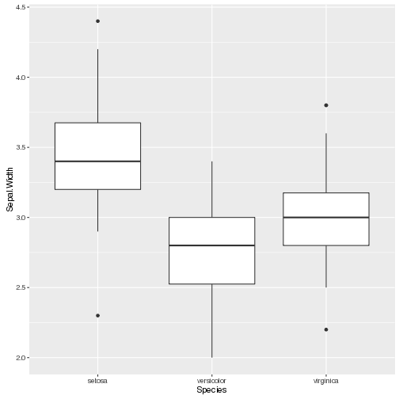 

###Histograms


```r
ggplot(iris,aes(x=Sepal.Width))+
  geom_histogram(binwidth=0.25)
```

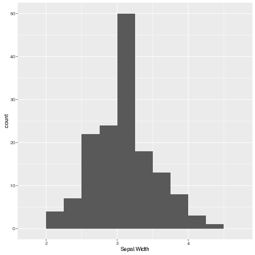 

###Barplots
Barplots can be done easily but often you want to plot a summary statistic (e.g. mean value) for different groups.  This requires setting up the data in the correct format first.  We can do that with `dplyr` first, then pass the result to `ggplot()`.


```r
iris_species_mean<-group_by(iris,Species) %>%
                    summarize(mean_pl=mean(Petal.Length))
iris_meanpl_bar<-ggplot(iris_species_mean,aes(x=Species,y=mean_pl))+
  geom_bar(stat="identity")
iris_meanpl_bar
```

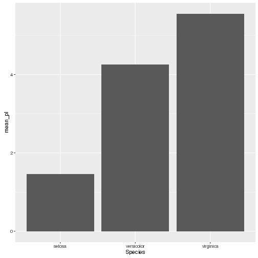 

##Exercise 4.1
Let's now build some plots with `ggplot2`

1. Add another section to the script to hold this code.

2. Try out a simple scatterplot, boxplot, and histogram on any of the data in our `nla_data` data frame.

2. Build a bar plot of the mean CHLA for each of the values in WSA_ECO9.

3. Lastly, build a scatter plot showing the relationship between PTL and CHLA (`log10()` transform both) with each LAKE_ORIGIN value a different color.  For some optional fun add in a regression line for each value of LAKE_ORIGIN.

##Customizing `ggplot2` plots
So, not bad, but they all look the same.  With a bit more dithering, the plots would be our own and be publication ready.  

###Themes
I am certain there are some opinions (good and bad) about the default look and feel of a `ggplot2` plot.  Personally, I think  it is an improvement over `base`, but generally not what I want for my plots.  The `theme()` function (and related functions), give us the ability to completely customize the plot.  A great place to start with this is the [themes vignette](http://docs.ggplot2.org/dev/vignettes/themes.html) within `ggplot2`  We could spend a whole day just on this, so for this class we are going to look at the very basics and then use some of the canned themes.

Let's first create a simple scatterplot.


```r
scatter_p<-ggplot(iris,aes(x=Petal.Width,y=Petal.Length)) +
              geom_point(aes(colour=Species, shape=Species))
scatter_p
```

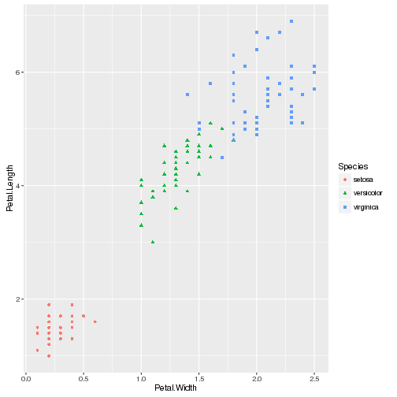 

Nothing new there.  Let's now edit some of this theme by dropping the grey background and the grid, and changing our font.


```r
scatter_p_base<-scatter_p + 
  theme(panel.background = element_blank(), 
        panel.grid = element_blank(),
        panel.border = element_rect(fill = NA),
        text=element_text(family="Times",colour="red",size=24))
scatter_p_base
```

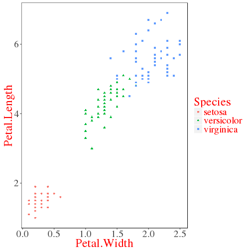 

Still not great, but it shows the basics.  You can build on this and edit EVERYTHING in the plot.  To get an idea of what you have access to, take a look at the help on `theme()` (e.g. `help("theme")`).

There are a few alterantive themes available by default (use `help("ggtheme")`) that save some time and typing.  Let's look at two.


```r
scatter_p + theme_bw()
```

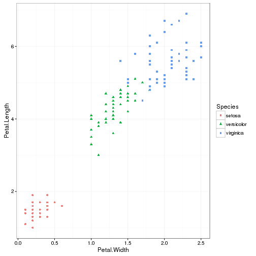 

```r
scatter_p + theme_classic()
```

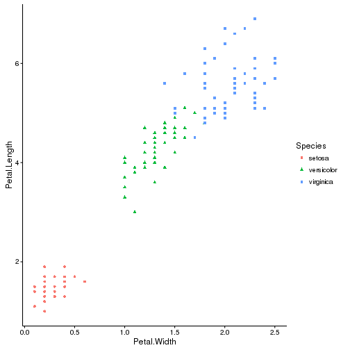 

Let's build on one of these and try to create a more polished plot.  We will start from scratch and add in some custom colors too.


```r
#Now Let's start over, with some new colors and regression lines
scatter_polished <- ggplot(iris,aes(x=Petal.Width,y=Petal.Length)) +
              geom_point(aes(colour=Species, shape=Species)) +
              stat_smooth(method="lm", aes(colour=Species)) +
              scale_colour_manual(breaks = iris$Species,
                                  values= c("steelblue1",
                                            "sienna",
                                            "springgreen3")) + 
              theme_classic(18,"Times") +
              theme(text=element_text(colour="slategray")) +
              labs(title="Iris Petal Morphology Relationship",
                     x="Petal Length", y="Petal Width")
              

scatter_polished 
```

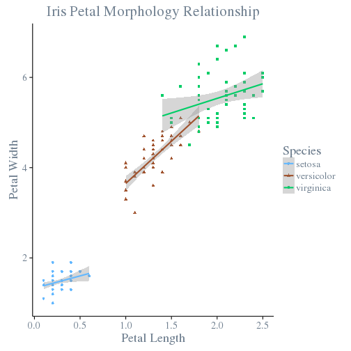 

A bit complicated for some of the custom stuff, but that is the price you have to pay to get complete control over the output.  Last thing we probably want to do now is to save the plot.  Since we have our plot as a `ggplot` object we can use the `ggsave()` function.


```r
#Save as jpg, with 600dpi, and set width and height
#Many other options in the help
ggsave(plot=scatter_polished,
       file="Fig1.jpg",dpi=600,width=8, heigh=5)
#Save as PDF
ggsave(plot=scatter_polished,
       file="Fig1.pdf")
```

##Exercise 4.2
From Exercise 1 you should have a good start on a plot.  Let's tweak this some.

1. Add a new section then:
2. Change up the theme of your plot.  This is your plot, so experiment.  Experiment with fonts, colors, backgrounds, etc.  Remember that all of the things you can change are listed in the help (`help("theme")`).  Also the various `element_xxx()` functions will be needed, try `??element_` .
2. If you have time, try to edit the colors of your points using `scale_colour_manual()`.
3. When you get the plot to a point where you are happy, save the plot to a file.  Use a dpi and file format of your liking.

##Cool stuff and getting help with `ggplot2`
In this last section we won't have an exercise, but I did want to show some other things that `ggplot2` can do and show some other functions that people have built on top of `ggplot2` that are pretty cool.  Lastly, I provide some links on more reading as well as some nice (and fun) data visualization galleries.

###Facets
First thing I want to show are facets.  Facets allow you to lay out multiple plots in a grid.  With a single facet the result is similar to what we already accomplished by coloring/sizing points based on a factor in the dataset, but it separates into different plots and we can easily add an additional factor to organize by column.  Looking at some of the examples provided with `facet_grid()` shows us how these can work.


```r
#From the examples in H. Wickham. ggplot2: elegant graphics for data analysis. 
#Springer New York, 2009. 
#In particular the facet_grid help.
p <- ggplot(mtcars, aes(mpg, wt)) + geom_point()
# With one variable
p + facet_grid(cyl ~ .)
```

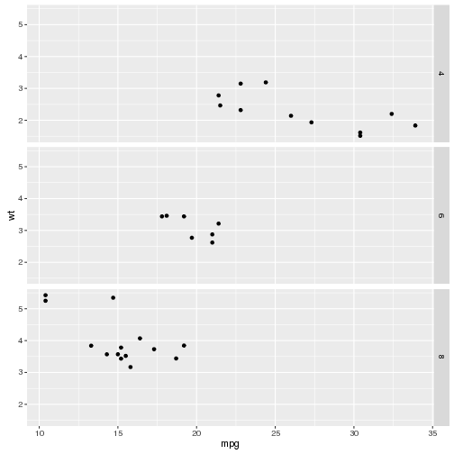 

```r
# With two variables
p + facet_grid(vs ~ am)
```

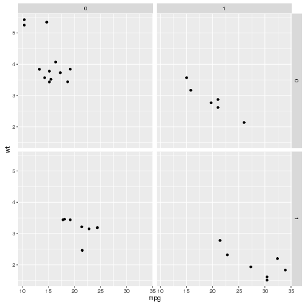 

And a parting example using the NLA data.


```r
tp_chla <- ggplot(nla_wq,aes(x=log10(PTL),y=log10(CHLA))) + geom_point()

tp_chla + facet_grid(RT_NLA ~ .)
```

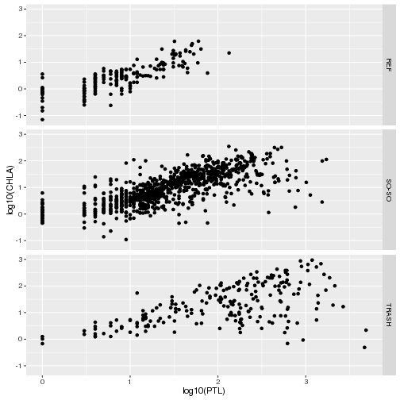 

```r
tp_chla +
  stat_smooth() +
  facet_grid(RT_NLA ~ LAKE_ORIGIN)
```

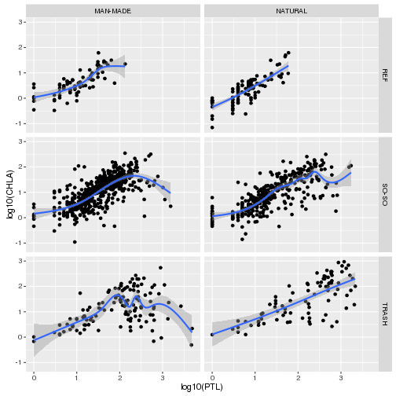 

###Sources of Help on `ggplot2`
- [Winston Chang's Cookbook](http://www.cookbook-r.com/Graphs/): Many great step-by-step examples.  Good starting point for you own plots
- [Offical `ggplot2` documentation](http://docs.ggplot2.org/current/): The authoritative source.  Also many great examples.  The [aesthetics vignette](http://docs.ggplot2.org/current/vignettes/ggplot2-specs.html) is good to know about.

###R Data Viz Examples
- Cool rCharts examples: [rCharts Gallery](http://rcharts.io/gallery/)
- ggplot examples: [Google Image Search](http://goo.gl/P0q2Lx)
- R Data Viz, gone wrong:[Accidental aRt](http://accidental-art.tumblr.com) 
- [London Bike Hires](http://spatialanalysis.co.uk/wp-content/uploads/2012/02/bike_ggplot.png)
- [Facebook Users](http://paulbutler.org/archives/visualizing-facebook-friends/facebook_map.png)
